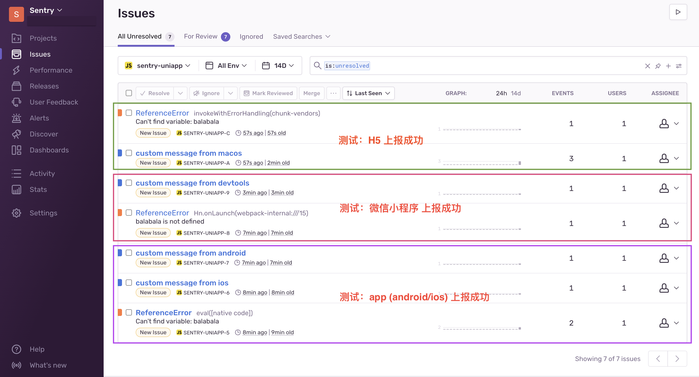
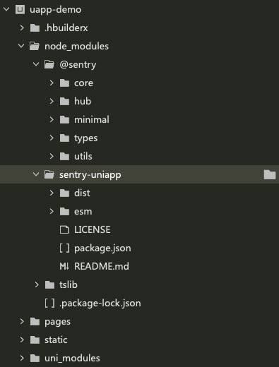
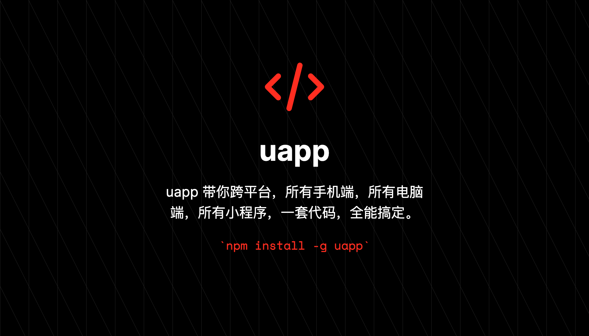

# sentry Uniapp SDK

`sentry Uniapp SDK` 的封装，可用于 Uniapp 全端，包含app, h5，微信小程序，抖音小程序，百度小程序等各家平台。

同时支持 Uniapp vue2 / vue3 工程。

> 提示：由于快应用 require 方式特殊性，webpack是在编译期处理的，动态代码检测无效，所以单独维护，包名为 sentry-quickapp。
 
快应用项目可参考：

<https://github.com/uappkit/sentry-quickapp>

## 用法

1、安装依赖

```bash
npm install sentry-uniapp
```

2、在 `App.vue => onLaunch` 中初始化

注意替换下方代码里的 `__DSN__`，并仔细阅读注释说明和常见问题

```js
export default {
   onLaunch: function () {
      console.log('App Launch');
      sentry.init({
         // __DSN__ 参考格式: https://8137b89b2d1c4e349da3a38dca80c5fe@sentry.io/1
         dsn: '__DSN__',

         // extraOptions 主要是解决平台差异问题的，见下方说明
         // 非 APP 平台，可以不用
         extraOptions: { onmemorywarning: false, onerror: false }
      });

      // 代码上报，extra 为可选的自定义对象内容
      sentry.captureMessage('custom message from ' + uni.getSystemInfoSync().platform, {
         UserId: 123,
         Command: 'npm i -g uapp'
      });

      // 触发一个未定义函数的错误
      balabala();
   },

   // sentry-uniapp 内部是通过 uni.onError 钩子函数捕获错误的
   // 但目前 uni.onError 暂不支持 App (android / ios)，各平台支持情况参考：
   // https://uniapp.dcloud.net.cn/api/application.html#onerror
   //
   // 通用方案：
   // 可用 App.onError 自己处理，但需要先禁用 sentry 里的捕获
   // 方法在 sentry.init 参数里加上 extraOptions: { onerror: false }
   onError: function (e) {
      sentry.captureException(e);
   }
}
```

3、其他可选配置

```js
   // Set user information, as well as tags and further extras
   sentry.configureScope((scope) => {
     scope.setExtra("battery", 0.7);
     scope.setTag("user_mode", "admin");
     scope.setUser({ id: "4711" });
     // scope.clear();
   });

   // Add a breadcrumb for future events
   sentry.addBreadcrumb({
     message: "My Breadcrumb",
     // ...
   });

   // Capture exceptions, messages or manual events
   // Error 无法定义标题，可以用下面的 captureMessage
   sentry.captureException(new Error("Good bye"));
 
   // captureMessage 可以定制消息标题，extra 为附加的对象内容
   sentry.captureMessage("message title", {
     extra
   });
 
   sentry.captureEvent({
     message: "Manual",
     stacktrace: [
       // ...
     ],
   });
```

## 参考示例

项目代码里的 `uapp-demo`，通过 HBuilderX 打开即可，下面截图为 `uapp-demo` 在各平台测试结果。



## 常见问题

1、大多数本地环境问题，成功安装后，目录结构如下图：



先通过 sentry.captureMessage 确认能上报成功，如果收不到，

* 可检测 `__DSN__` 是否正确
* 检测网络，最好通过配置代理拦截下网络请求是否存在

2、提示 onmemorywarning 未实现错误

> API `onMemoryWarning` is not yet implemented __ERROR

有的平台不支持 `memorywarning` 的监听，可以 sentry.init 里禁用:

```.js
   sentry.init({
      dsn: '__DSN__',
      extraOptions: { onmemorywarning: false }
   });
```

3、暂不支持 sentry.init 开启 debug，移除 或设置 false

> [Vue warn]: Error in onLaunch hook: "TypeError: undefined is not an object (evaluating '(_a = global.console)[name]')"[ERROR] : [Vue warn]: Error in onLaunch hook: "TypeError: undefined is not an object (evaluating '(_a = global.console)[name]')"(found at App.vue:1) __ERROR

```.js
   sentry.init({
      dsn: '__DSN__',
      debug: false,
   });
```

4、代码异常没有自动上报的，可查看 HBuilderX 的 log 窗口，区分以下两种错误情况

[JS Framework] 开头，由 framewrok 底层拦截 `不会触发 sentry 上报`，错误信息如下:

> [JS Framework] Failed to execute the callback function:[ERROR] : [JS Framework] Failed to execute the callback function:ReferenceError: Can't find variable: balabala __ERROR

Vue 层报的错误，可以触发 sentry 上报，错误信息如下:

> [Vue warn]: Error in onLaunch hook: "ReferenceError: Can't find variable: balabala"[ERROR] : [Vue warn]: Error in onLaunch hook: "ReferenceError: Can't find variable: balabala"(found at App.vue:1) __ERROR

## 功能特点

- [x] 基于 [sentry-javascript 最新的基础模块](https://www.yuque.com/lizhiyao/dxy/zevhf1#0GMCN) 封装
- [x] 遵守[官方统一的 API 设计文档](https://www.yuque.com/lizhiyao/dxy/gc3b9r#vQdTs)，使用方式和官方保持一致
- [x] 使用 [TypeScript](https://www.typescriptlang.org/) 进行编写
- [x] 包含 Sentry SDK（如：[@sentry/browser](https://github.com/getsentry/sentry-javascript/tree/master/packages/browser)）的所有基础功能
- [x] 支持 `ES6`、`CommonJS` 两种模块系统（支持小程序原生开发方式、使用小程序框架开发方式两种开发模式下使用）
- [x] 默认监听并上报小程序的 onError、onUnhandledRejection、onPageNotFound、onMemoryWarning 事件返回的信息（各事件支持程度与对应各小程序官方保持一致）
- [x] 默认上报运行小程序的设备、操作系统、应用版本信息
- [x] 支持微信小程序
- [x] 支持微信小游戏
- [x] 支持字节跳动小程序
- [x] 支持支付宝小程序
- [x] 支持钉钉小程序
- [x] 支持百度小程序
- [x] 支持快应用
- [x] 支持在 [Taro](https://taro.aotu.io/) 等第三方小程序框架中使用
- [x] 默认上报异常发生时的路由栈
- [ ] 完善的代码测试

## 感谢

本项目基于下面开源基础上修改，感谢原作者:

<https://github.com/lizhiyao/sentry-miniapp>

## 联系作者

微信: yinqisen

推荐另一个开源作品 `uapp`, 方便 Uniapp 离线打包的 cli。  

<https://github.com/uappkit/uapp>


